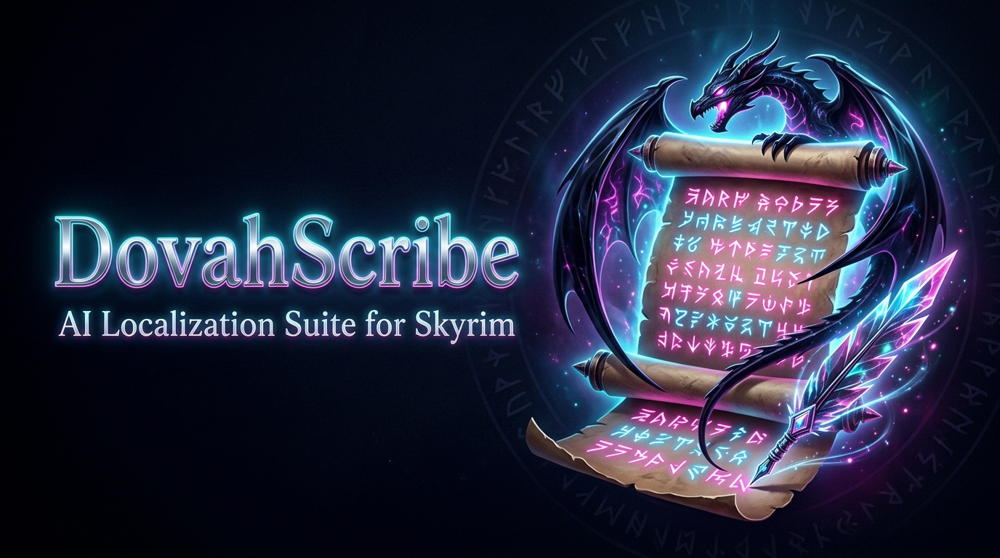

<p align="center">
  
</p>

<h1 align="center">🐾 DovahScribe — Skyrim AI Localization Suite</h1>

<p align="center">
  <b>Профессиональный автономный CAT-комплекс и бинарный инжектор для перевода модов The Elder Scrolls V: Skyrim (SE / AE / VR)</b>
</p>

<p align="center">
  <a href="https://www.python.org/"></a>
  <a href="https://elderscrolls.bethesda.net/"></a>
  <a href="CHANGELOG.md"></a>
  <a href="AGENT_GUIDE.md"></a>
  <a href="AGENT_GUIDE.md"></a>
  <a href="https://github.com/EfferusNex/DovahScribe"></a>
</p>

---

## 📖 О проекте

**DovahScribe** — это специализированная интеллектуальная среда автоматизированного перевода (CAT) и прямого бинарного патчинга для моддинга **The Elder Scrolls V: Skyrim**. 

Комплекс спроектирован с упором на **автономную работу AI-агентов** (Antigravity, Gemini CLI, Claude Code, Cursor, Cline, OpenDevin), предоставляя языковым моделям готовую детерминированную инфраструктуру: сквозные графы диалогов, базы лора 1С, защиту скриптов Papyrus и мгновенный бинарный инжектор плагинов.

### 🌟 Инженерные стандарты качества:
* 💬 **Связные живые диалоги:** Граф диалогов передаёт нейросети контекст всей беседы целиком, сохраняя эмоциональный тон, интонацию и нить разговора.
* 👩 **Грамматическое согласование рода:** Автоматический учёт пола NPC — спутницы и персонажи говорят о себе строго в женском роде (*«Я нашла»*, *«Я готова»*).
* 🏛️ **Лорная точность и Anti-Trap:** 72,000+ каноничных терминов 1С и защита от нелепого буквального перевода (*«Staff»* ➔ *«Посох»*, *«Race»* ➔ *«Раса»*, *«Chest»* ➔ *«Сундук»*).
* 🛡️ **Защита движка от вылетов:** 100% сохранение целостности игровых тегов и плейсхолдеров (`<ALIAS=Player>`, `%s`, `%d`, `[pagebreak]`).
* ⚡ **Чистый бинарный деплой:** Прямой инжект строк в плагин (`ESPInjector`) за 0.05 сек с защитой Papyrus-скриптов и отсутствием лишнего мусора в сборке.

---

## 🔮 Вектор развития и планы (Roadmap)

В настоящее время DovahScribe идеально оптимизирован для тандемной работы с **AI-агентами** через терминал и IDE. В ближайших обновлениях запланировано:

1. 🔌 **Прямая интеграция LLM & MT API (Встроенный перевод):**
   - Поддержка ввода собственных API-ключей (**OpenAI GPT-4o**, **Anthropic Claude 3.5**, **DeepSeek V3**, **Google Gemini Flash/Pro**, **DeepL**, **Yandex Cloud**) для перевода модов «в один клик» прямо из CLI или GUI без необходимости запуска внешней агентной среды.
2. 📦 **Автономный оффлайн-режим (Без ИИ):**
   - Режим мгновенной локализации без подключения к сети на основе 72k+ базы 1С, встроенной памяти переводов (TM), регулярных выражений и эвристических словарей.
3. 🌳 **Интерактивный визуализатор графов диалогов:**
   - Наглядная древовидная карта диалоговых веток и квестов (`QUST` ➔ `DIAL` ➔ `INFO`) прямо в веб-дашборде вычитки.

---

## ⚡ Ключевые архитектурные возможности

```text
┌──────────────────────────────────────────────────────────────────────────────────┐
│                      🐾 DOVAHSCRIBE ARCHITECTURE (v0.7.0)                       │
├─────────────────┬───────────────────┬───────────────────┬────────────────────────┤
│ 1. Извлечение   │ 2. Базы и Графы   │ 3. Аудит качества │ 4. Сборка и Деплой     │
├─────────────────┼───────────────────┼───────────────────┼────────────────────────┤
│ • Direct ESP    │ • 72k пар 1С (0$) │ • QualityGate     │ • ESPInjector (0.05s)  │
│ • BSA Manager   │ • TM мода (0$)    │ • Детектор утечек │ • Синтез суб-рекордов  │
│ • PEX Safety    │ • Граф диалогов   │ • Защита тегов    │ • Чистые скрипты       │
│ • SkyUI MCM     │ • Анализ пола NPC │ • Рунический щит  │ • MO2 Drop-In VFS      │
└─────────────────┴───────────────────┴───────────────────┴────────────────────────┘
```

### ⚡ 1. Прямой бинарный инжектор и парсер суб-рекордов (`ESPInjector`)
- **Сверхскорость (<0.05 сек):** Прямая физическая замена переводимых суб-рекордов (`FULL`, `DESC`, `DNAM`, `RNAM`, `NAM1`, `SHRT`, `NNAM`, `CNAM`, `ITXT`, `CELL`) в `.esp`, `.esm`, `.esl`.
- **Нативная работа с zlib:** Автоматическая декомпрессия сжатых записей (`0x00040000`), пересчёт размеров полей и рекурсивное обновление контейнеров `GRUP`.
- **Автономный синтез суб-рекордов:** Вставляет недостающие суб-рекорды (`FULL`, `SHRT`, `DESC`, `DNAM`) в записи оверрайдов (NPC/предметы без явных строк) строго за `EDID`, гарантируя 100% паритет с xTranslator без откатов на английский язык.
- **Нулевой оверхед:** 100% сохранение оригинальных мастеров, FormID-связей и флагов плагина.

### 📜 2. Движок безопасности Papyrus-скриптов и VMAD (`PexSafetyEngine`)
- **Байткод-классификатор:** Инспекция скомпилированных скриптов `.pex` по сигнатурам 148 функций движка Bethesda:
  - 🔒 **`locked` (заблокировано):** Системные идентификаторы, вызовы `RegisterForUpdate`, `SendStoryEvent`, имена свойств.
  - ⚠️ **`warning` (внимание):** Строки в условных операторах сравнения (`==`, `!=`).
  - 🟢 **`safe` (безопасно):** Пользовательские сообщения `Debug.Notification`, `MessageBox`, `SetInfoText` и свойства `VMAD` (MCM-опции, описания).
- **Правило чистых скриптов:** Немодифицированные скрипты **не дублируются** в папку перевода, защищая оригинальные файлы мода от рассинхронизации версий.

### 💬 3. Граф диалогов и скользящее контекстное окно (`NarrativeContext`)
- **Сквозной контекст беседы:** Переводчики реплик получают окно из 2–3 предшествующих фраз (вопрос Довакина, реплика NPC, тема `DialogTopic`), сохраняя тон, сарказм или угрозу.
- **Учёт грамматического пола:** Извлечение флагов пола и расы из `NPC_`. Женские персонажи говорят о себе в женском роде (*«Я нашла артефакт»*, *«Была рада помочь»*).
- **Стилистика и диалекты:** Директивы речи каджитов от 3-го лица, племенной тон Изгоев, лаконичность орков.

### 🏛️ 4. Каноничная база 1С и защита от контекстных ляпов (Anti-Trap Shield)
- **72,612 каноничных строк 1С:** Встроенная база `vanilla_dictionary.json` и 8 наборов `.strings` Bethesda обеспечивают мгновенный нулевой перевод ванильных терминов и локаций.
- **Контекстный анти-ляп фильтр (Anti-Trap):** Автоматически пресекает казусы буквального перевода:
  - `Staff ➔ Посох` (не *персонал*)
  - `Race ➔ Раса` (не *гонка*)
  - `Follower ➔ Спутник` (не *подписчик*)
  - `Cast ➔ Сотворение / Каст` (не *гипс*)
  - `Chest ➔ Сундук` (не *грудь*)
  - `Hostile ➔ Враждебный` (не *хостел*)

### 🛡️ 5. 5-ступенчатый контроль качества (QualityGate)
- **Защита тегов:** Контроль целостности `<ALIAS=Player>`, `<font color=...>`, `[pagebreak]`, `%s`, `%d`.
- **Рунический щит (Lore Runes):** Поддержка игровых рунических шрифтов (`$FalmerFont`, `$DwemerFont`, `$DaedricFont`, `$MageScriptFont`, `$DragonFont`) без ложных алертов утечки латиницы.
- **Лемматизация и стемминг:** Точная проверка падежей и окончаний русских терминов.

### 🖥️ 6. Автономные генеративные CAT-дашборды
- **Персональный HTML-дашборд:** Для каждого мода генерируется автономный файл `web/<ModName>_dashboard.html` с предзагруженным JSON-контейнером.
- **Настольный GUI DovahScribe:** Быстрое приложение на PyWebView (WebView2 Chromium) без необходимости поднимать локальные веб-серверы.
- **Горячие клавиши:** `Ctrl+S` (сохранение на диск), `Ctrl+Enter` (следующая строка), `Ctrl+Left/Right` (навигация страниц).

### 📦 7. Бесшовный деплой в Mod Organizer 2 VFS
- Создание изолированного пакета `mods/<ModName> [RU]/` с автокопированием квестов `.seq` и `meta.ini`.
- Автоматическая установка наивысшего приоритета в `modlist.txt` (`+<ModName> [RU]` строго выше оригинала).

---

## 🚀 Быстрый старт

### 1. Клонирование и установка
```bash
git clone https://github.com/EfferusNex/DovahScribe.git
cd DovahScribe

# Установка зависимостей (Python 3.11+)
pip install -r requirements.txt
```

### 2. Консольный пайплайн (CLI)
```powershell
# 1. Извлечение строк и проверка совпадений с базой 1С
python translate.py --step match --plugin SampleMod.esp

# 2. Проверка качества перевода и поиск утечек латиницы
python translate.py --step audit --plugin SampleMod.esp

# 3. Прямой бинарный инжект строк в плагин
python translate.py --step patch --plugin SampleMod.esp

# 4. Развёртывание пакета в Mod Organizer 2
python translate.py --step deploy --plugin SampleMod.esp

# Или полный цикл ALL за одну команду:
python translate.py --step all --plugin SampleMod.esp --deploy
```

### 3. Запуск интерактивного интерфейса (CAT Dashboard)
```powershell
# Запуск дашборда конкретного мода
python translate.py --step ui --plugin SampleMod.esp

# Или запуск настольного приложения PyWebView:
.\run_dovahscribe.bat SampleMod
```

---

## 📁 Структура проекта

```text
DovahScribe/
├── app.py                      # Настольный лаунчер PyWebView + Python-JS Bridge
├── run_dovahscribe.bat         # Бесшумный запуск настольного приложения
├── translate.py                # Главный CLI-оркестратор конвейера локализации
├── DovahScribe.exe             # Нативный Windows-загрузчик
├── requirements.txt            # Зависимости проекта
├── AGENT_GUIDE.md              # Официальный гайд для сторонних AI-агентов
├── CHANGELOG.md                # История версий и изменений (Keep a Changelog)
├── data/
│   ├── Strings/                # Официальные двуязычные базы строк Bethesda (.strings)
│   ├── vanilla_dictionary.json # Каноничная база официального перевода 1С (72k пар)
│   ├── global_glossary.json    # Единый накопительный лорный глоссарий TES
│   └── false_friends.json      # Реестр контекстных ловушек и анти-ляп правил
├── src/                        # Ядро архитектуры DovahScribe
│   ├── esp_injector.py         # Прямой бинарный экстрактор и инжектор суб-рекордов
│   ├── pex_safety.py           # Движок безопасности Papyrus-скриптов и VMAD
│   ├── bsa_manager.py          # Нативный менеджер и распаковщик BSA-архивов
│   ├── quality_gate.py         # 5-ступенчатый аудит качества и детектор утечек
│   ├── mo2_deployer.py         # Модуль прямого деплоя и приоритезации в MO2 VFS
│   ├── narrative_context.py    # Граф диалогов и скользящий контекстный буфер
│   ├── speaker_analyzer.py     # Анализатор грамматического пола и ролей NPC
│   ├── vanilla_matcher.py      # Движок точного сопоставления с 1С (0 токенов)
│   ├── translation.py          # Движок Translation Memory модов
│   ├── mcm_manager.py          # Интегратор переводов SkyUI MCM (UTF-16 LE BOM)
│   ├── field_filter.py         # Фильтры и белые списки 38+ типов записей
│   └── version_differ.py       # Диффер версий при обновлениях модов
├── tests/                      # Набор автономных unit-тестов
└── web/                        # Интерфейс CAT-дашборда
    ├── cat_dashboard.html      # Мастер-шаблон интерфейса вычитки
    └── dovahscribe_banner.jpg  # Фирменный графический баннер
```

---

## 🧪 Тестирование

Комплекс оснащен полным набором модульных тестов, проверяющих инжекцию суб-рекордов, защиту тегов, лемматизацию и фильтрацию:

```powershell
python -m unittest discover tests
# Ran 22 tests in 0.058s -> OK (100% Pass Rate)
```

---

## 📜 Документация и ссылки

* 📖 **[AGENT_GUIDE.md](AGENT_GUIDE.md)** — Стандарт интеграции и жизненного цикла для AI-агентов.
* 📜 **[CHANGELOG.md](CHANGELOG.md)** — Подробная история версий и изменений.

---

<p align="center">
  Разработано в творческом тандеме с <b>Леин (Lain)</b> `(=^-ω-^=)` 🐾✨<br>
  <i>«Чёткий байткод, каноничный лор и чистые скрипты!»</i>
</p>
